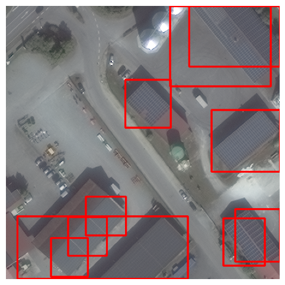
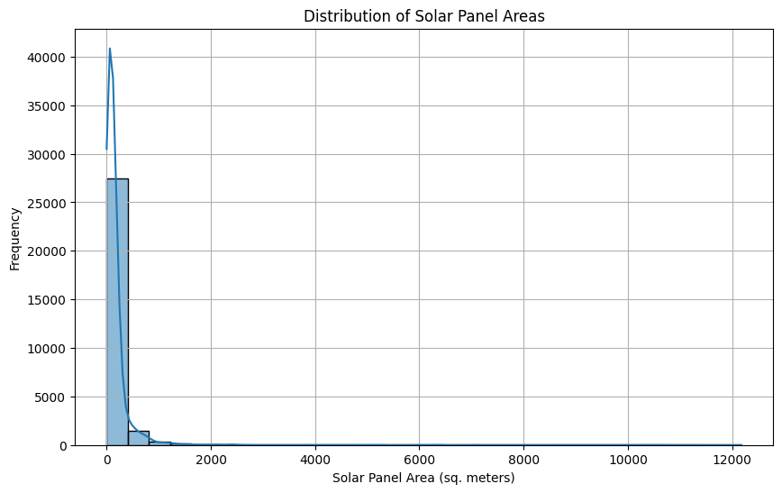
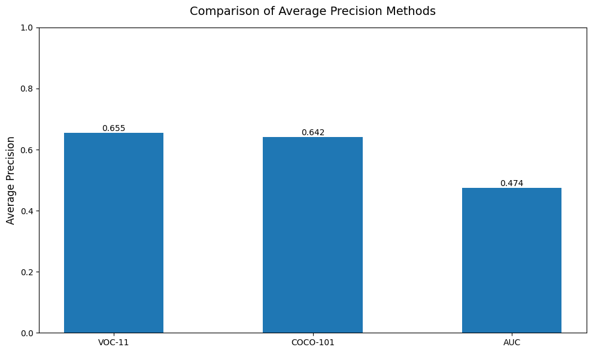
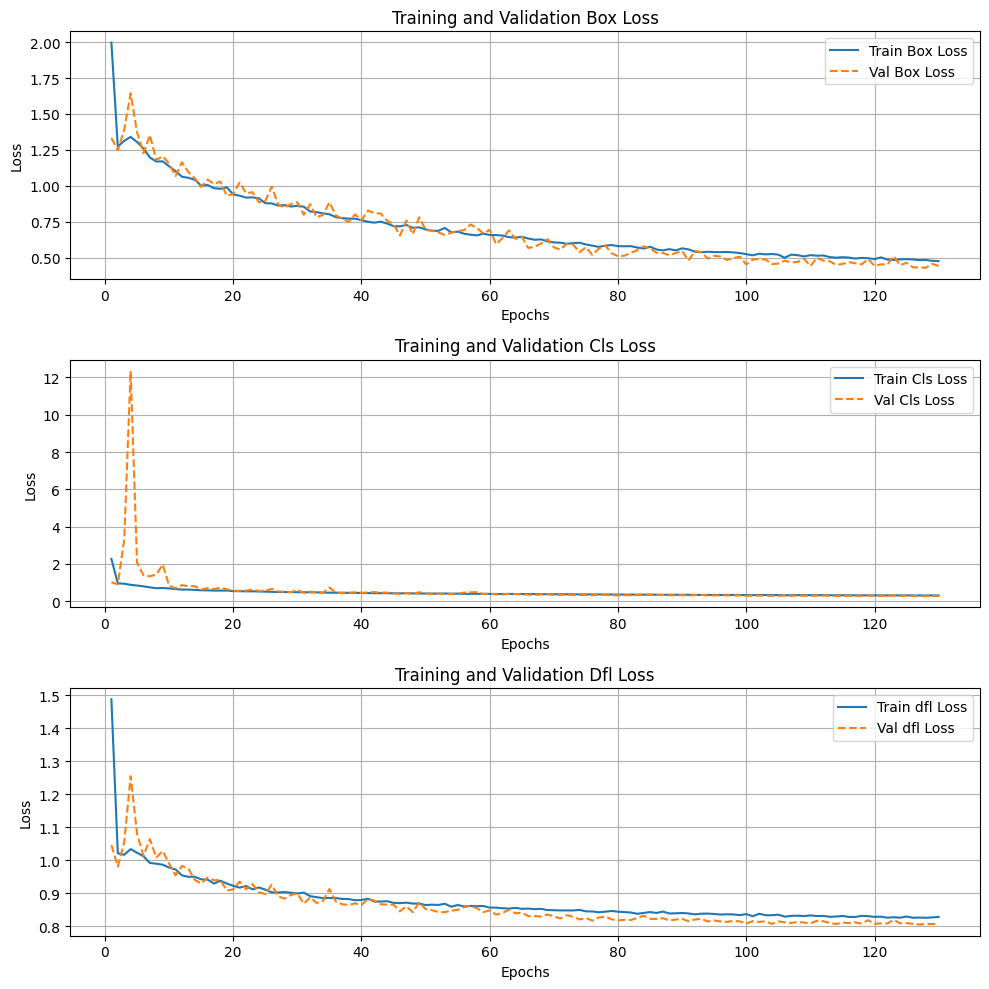

# IIT Gandhinagar Summer Research Internship Program (SRIP) Selection Task Solution

## Introduction
This repository contains my solution for the selection task of the **IIT Gandhinagar Summer Research Internship Program (SRIP)**.

## Dataset Structure
#### Naming Convention
(dataset, image type, tile identification number, minimum x bound, minimum y bound, and window size)

#### Images
1. The dataset consists of image chips (small cropped satellite images) in .tif format. Each image chip represents a portion of a larger tile.
2. resolution of the image is 416x416 pixel.
#### Labels
1. Each label file contains information about multiple solar panel objects present in the corresponding image chip.
2. Each row of a label file contain (category, x-center, y-center, x-width, y-width).
3. The values of are normalized



## Repository Structure
- `cleaned_solution.ipynb` - Jupyter Notebook containing the full solution, including data preprocessing, model development, and evaluation.
- `README.md` - Documentation of the project.

## Requirements
To run this solution, install the following dependencies:
```bash
pip install -r requirements.txt
```

## Usage
To execute the notebook:
1. Clone the repository:
   ```bash
   git clone <repo-url>
   cd <repo-folder>
   ```
2. create a data repository and add place data image and labels data after downloading the data from the provided drive link.
```bash
data/
├── images/
│   ├── solarpanels_native_1__x0_0_y0_6845_dxdy_416.tif
│   ├── solarpanels_native_1__x0_55_y0_7644_dxdy_416.tif
│   └── ... (other image files)
└── labels/
    ├── solarpanels_native_1__x0_0_y0_6845_dxdy_416.txt
    ├── solarpanels_native_1__x0_82_y0_6947_dxdy_416.txt
    └── ... (other label files)
```


## Results
### Data Exploration and Understanding
#### 1(a). How many instances of solar panels are present in the dataset?

      Number of solar panels in dataset:  29625

#### 1(b). Compute and show the value counts of labels per image. E.g., X images have 0 labels, Y images have 1 label, … and so on.

| Index | No_of_images | labels |
|-------|--------------|--------|
| 0     | 3            | 221    |
| 1     | 4            | 218    |
| 2     | 5            | 217    |
| 3     | 6            | 189    |
| 4     | 8            | 184    |
| ...   | ...          | ...    |
| 69    | 55           | 1      |
| 70    | 64           | 1      |
| 71    | 22           | 1      |
| 72    | 61           | 1      |
| 73    | 78           | 1      |

#### 2(a). What method was used to compute the area (in meters) for a single instance?
Ans. Since we have already calculated the geo-coordinates we can multiply the widht and height of the bounding box to get an estimate of area in meter

        total Area :  5673715.650499898

#### 2(b). What is the mean area and standard deviation?

        mean area:  191.5178278649789

        standard deviation of area:  630.7003355500086

#### 2(c). Plot the histogram of areas. What do you observe?



We can say that majrity of th e solar panels (92.6%) have area less than 407 m^2

### Implementing the Fundamental Functions

#### 1. Write a function to compute IoU (Intersection over Union)

        IoU from custom function: 0.5840266222961731
        IoU from Supervision library : 0.58403
      
#### 2(a). Use Pascal VOC 11 point interpolation method to implement the function 

        Average Precision (VOC 11 points): 0.41287878787878785

#### 2(b). Use COCO 101-point interpolation method to implement the function

        Average Precision (COCO 101 points): 0.41996699669966986

#### 2(c). Use Area under Precision-Recall Curve (AP) method to implement the function 

        Average Precision (AUC): 0.2745039682539682

#### 2(d). Randomly generate 10 images of size 100x100. Randomly generate 10 ground truth boxes of size 20x20 and 10 predicted boxes of size 20x20 in each image. Assume there is only one class of objects. Compare the AP50 (Average Precision at IoU 0.5) computed by 3 of your methods



### Model building and evaluation

#### 1. Use any model from Ultralytics like YOLO to train the object detection model. Show that validation loss is converged. 

- Trained YOLO11m model for 500 epochs with early stopping patience of 20 and batch size 32.
- Training stopped after 130 epochs




#### 2. Predict solar panels using the trained model. Visualize the ground truth and predicted bounding boxes on 3-4 random samples from the test dataset. Use appropriate color schemes to differentiate between ground truth and predicted labels.

#### 3(a). Compute mAP50 with supervision and compare with your implementation. What do you observe 

        mAP50 calculated using supervision library : 0.9861568506491517

        mAP50 (VOC-11): 0.9666

        mAP50 (COCO-101): 0.9713

        mAP50 (AUC): 0.8008

Observation : The mAP50 calculated using supervision library is closest to the one calculated using COCO-101 method.

#### 3(b). Create a table of Precision, Recall and F1-scores where rows are IoU thresholds [0.1, 0.3, 0.5, 0.7, 0.9] and columns are confidence thresholds [0.1, 0.3, 0.5, 0.7, 0.9].

## PRECISION TABLE:
|        | Conf_0.1 | Conf_0.3 | Conf_0.5 | Conf_0.7 | Conf_0.9 |
|--------|---------|---------|---------|---------|---------|
| IoU_0.1 | 0.980   | 0.979   | 0.971   | 0.945   | 0.397   |
| IoU_0.3 | 0.980   | 0.979   | 0.970   | 0.945   | 0.397   |
| IoU_0.5 | 0.979   | 0.978   | 0.970   | 0.945   | 0.397   |
| IoU_0.7 | 0.968   | 0.967   | 0.961   | 0.942   | 0.397   |
| IoU_0.9 | 0.703   | 0.703   | 0.702   | 0.700   | 0.387   |

## RECALL TABLE:
|        | Conf_0.1 | Conf_0.3 | Conf_0.5 | Conf_0.7 | Conf_0.9 |
|--------|---------|---------|---------|---------|---------|
| IoU_0.1 | 0.961   | 0.967   | 0.987   | 0.996   | 1.000   |
| IoU_0.3 | 0.961   | 0.967   | 0.986   | 0.996   | 1.000   |
| IoU_0.5 | 0.960   | 0.966   | 0.986   | 0.995   | 1.000   |
| IoU_0.7 | 0.949   | 0.955   | 0.977   | 0.992   | 1.000   |
| IoU_0.9 | 0.689   | 0.694   | 0.714   | 0.737   | 0.974   |

## F1 TABLE:
|        | Conf_0.1 | Conf_0.3 | Conf_0.5 | Conf_0.7 | Conf_0.9 |
|--------|---------|---------|---------|---------|---------|
| IoU_0.1 | 0.971   | 0.973   | 0.979   | 0.970   | 0.569   |
| IoU_0.3 | 0.971   | 0.973   | 0.978   | 0.970   | 0.569   |
| IoU_0.5 | 0.969   | 0.972   | 0.978   | 0.969   | 0.569   |
| IoU_0.7 | 0.958   | 0.961   | 0.969   | 0.966   | 0.569   |
| IoU_0.9 | 0.696   | 0.699   | 0.708   | 0.718   | 0.554   |


## Acknowledgment
This work was done as part of the selection process for the **IIT Gandhinagar Summer Research Internship Program**.